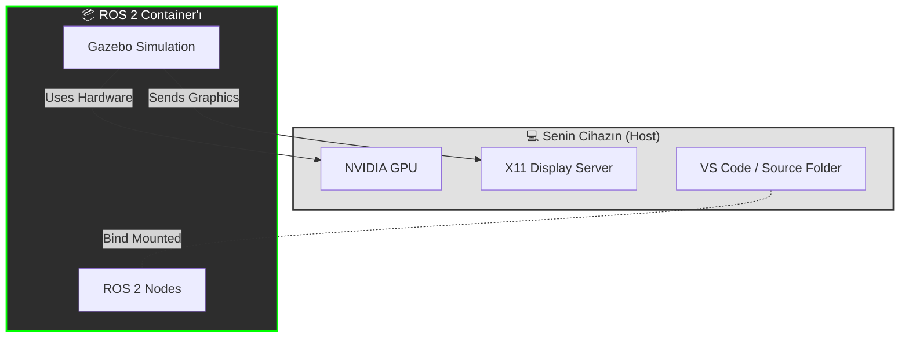

# 🕷️ ROSpider: Docker kurulum rehberi 


> **"Benim cihazımda çalışıyorsa, seninkindede çalışır."**
> Bu rehber platfrom farketmeksizin **Tekraralanabilir** sonuç almamızı sağlayacak. ROS 2 ve Gazebo'yu bir container içerisinde çalıştırıcaz,
> Kodalama işlemini ise ana cihazınızda yapabileceksiniz.

---------

### 🏗️ Mimari (Nasıl çalışıyor)
Kullandığımız setup'ın çalışma mantığı:



-------

### 🛠️ Detaylı kurulum (Yalnızca ilk kurulum sırasında)

--------

1. Ön gereksimler.


    🐧Linux için:
    
    * Docker'ı indir: [Resmi Rehber](https://docs.docker.com/engine/install/ubuntu/)
    
    * NVIDIA Container Toolkit'ini indir: [Resmi Rehber](https://docs.nvidia.com/datacenter/cloud-native/container-toolkit/latest/install-guide.html)[^1]
    
    * Docker'ı yüklediğinizden emin olun. Daha sonra terminalde aşşağıdaki komutu çalıştırın
    
    ```
                sudo usermod -aG docker $USER
                # Oturumu kapatıp açmayı unutmayın!
   ```

    🪟 Windows için:
    
    * WSL 2'yi indir: PowerShell'i yönetici olarak çalıştırıp **wsl --install**. komutunu girin.
    
    * Docker Desktop uygulamasını indirip ayarlardan, "WSL 2 Backend" kısmını aktive ediniz.
    
    * VcXsrv'i indir: (GUI için gerekli)
    
    * "XLaunch"'ı çalıştır, 
    
    * "Multiple Windows" u seç,
    
    * **ÖNEMLİ!**, "Disable access control" kutucuğu tıkla.

--------------

## 2. Proje Dosya yapısı.

-----------

   ```
    my_project/
    ├── src/                  <-- Source code (bind-mounted)
    ├── docker/
    │   ├── Dockerfile        <-- The image definition
    │   └── entrypoint.sh     <-- The startup script
    └── docker-compose.yml    <-- The configuration
   ```

------------

## 3. Configuration Dosyaları

------------

**Kopyala yapıştır.**

A. docker/entrypoint.sh
   ```
#!/bin/bash
set -e

source /opt/ros/humble/setup.bash

if [ -f "/root/colcon_ws/install/setup.bash" ]; then
    source /root/colcon_ws/install/setup.bash
fi

exec "$@"
   ```
B. docker/Dockerfile

   ```
FROM osrf/ros:humble-desktop-full

# 1. Install development tools and Gazebo bridges
RUN apt-get update && apt-get install -y \
    python3-colcon-common-extensions \
    git \
    nano \
    ros-humble-gazebo-ros-pkgs \
    ros-humble-ros-gz \
    && rm -rf /var/lib/apt/lists/*

# 2. Setup the workspace directory
WORKDIR /root/colcon_ws

# 3. Copy and configure the entrypoint
COPY docker/entrypoint.sh /entrypoint.sh
RUN chmod +x /entrypoint.sh

# 4. Environment variables for GPU support
ENV NVIDIA_VISIBLE_DEVICES=all
ENV NVIDIA_DRIVER_CAPABILITIES=all
ENV QT_X11_NO_MITSHM=1

ENTRYPOINT ["/entrypoint.sh"]
CMD ["bash"]
   ```

C. docker-compose.yml
   ```
services:
  dev_env:
    build:
      context: .
      dockerfile: docker/Dockerfile
    image: ros_gazebo_studio
    container_name: ros_studio
    # GPU Acceleration
    deploy:
      resources:
        reservations:
          devices:
            - driver: nvidia
              count: 1
              capabilities: [gpu]
    # Display and Networking
    environment:
      - DISPLAY=${DISPLAY}
      - QT_X11_NO_MITSHM=1
    volumes:
      - ./src:/root/colcon_ws/src     # Syncs your code
      - /tmp/.X11-unix:/tmp/.X11-unix:rw # Syncs the display (Linux)
    network_mode: host
    privileged: true
    stdin_open: true
    tty: true
   ```
-------------

## 4. Nasıl Çalıştırılır. (NOT: WINDOWS İÇİN DAHA SONRA EKLEMELER YAPILACAK)

-------------

   Adım 1: Host cihazda grafik ekran oluşturulmasına izin ver. (Bilgisayarı her açıp kapamada aynı izini vermeniz lazım)
   ```
    xhost +local:root
   ```
   Adım 2: Docker'ı çalıştırıyoruz 
   ```
    docker-compose up -d
   ```
   Adım 3: Docker ortamına giriş yapıyoruz.
   ```
   docker exec -it ros_studio bash
   ```
   Adım 4: Geliştirmeye Başlayabilirsin!
   
  * "src/" kısmında istediğin bir ide ile kodda değişiklik yapabilirsin.
  
  * Docker konteynırını açtığın terminale tekrar gir ve projeyi inşa et.
    
   ```
    colcon build --symlink-install
    source install/setup.bash
   ```
-------

### 🛑 HATA GİDERME.

1. "Authorization Required" veya Gazebo anında çöküyor.
   * **Sebebi:** Cihazın docker'ın grafik oluşturma isteğini reddediyor.
   * **Çözüm:** ``` xhost +local:root ``` komutunu ana makinanın terminalinde çalıştır

2. "Package 'ament_cmake' not found" during build.
   * **Sebebi:** Ros ortamı tanımlanmamıştır.
   * **Çözüm:** ```source /opt/ros/humble/setup.bash ``` Komutunu docker içerinde çalıştır.

3. "Launch file not found" (after creating it).
   * **Sebebi:** You didn't rebuild, or you forgot the install(DIRECTORY ...) block in CMake.
   * **Çözüm:** Check CMakeLists.txt, then run ```colcon build --symlink-install and source install/setup.bash.```

4. "docker: 'compose' is not a docker command"
   * **Çözüm:** Docker pluginini manuel olarak indir.
```
 # Ubuntu / Debian
sudo apt-get update
sudo apt-get install docker-compose-plugin
```
```
# Fedora / RedHat
sudo dnf install docker-compose-plugin
```

------- 

✅The "Sanity Check"

Before asking for help, please verify:

- [x] Is Docker running? (docker ps)
    
- [ ] Did you run xhost? (See above)
    
- [ ] Is your folder structure correct?
